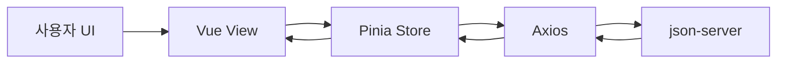
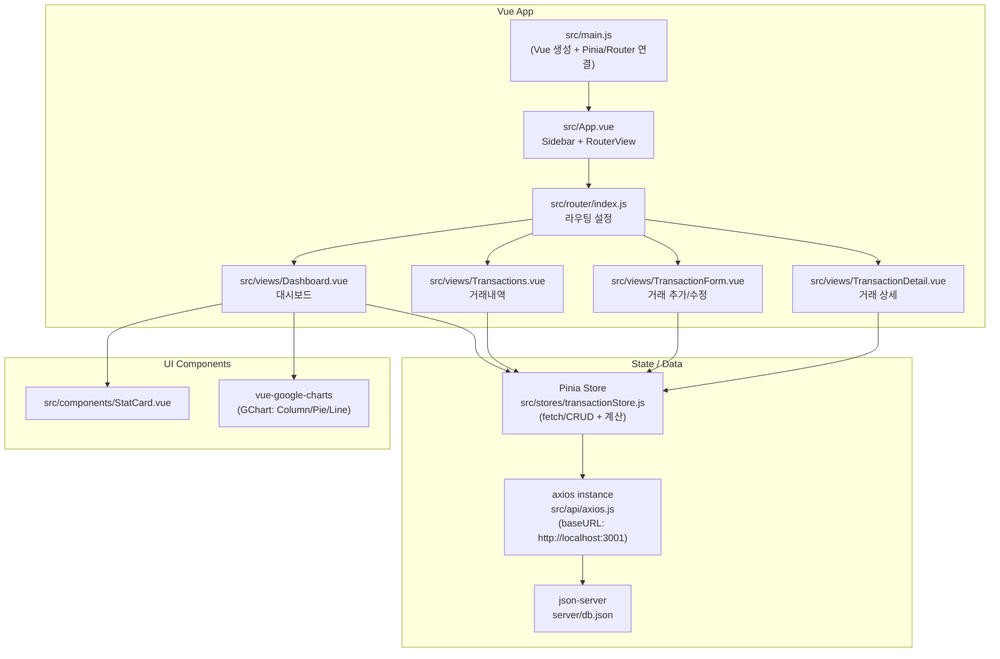

# 💸 Budget Dashboard

Vue 3 기반으로 만든 **가계부 대시보드 프로젝트**입니다.  
거래 내역을 CRUD로 관리하고, 대시보드에서 수입/지출 흐름을 시각적으로 확인할 수 있습니다. 📊

---

## ✨ 주요 기능

- 📈 월별 수입/지출 추이 차트
- 🧾 거래 내역 조회, 검색, 필터링
- ➕➖ 거래 추가/수정/삭제 (CRUD)
- 🧠 Pinia 기반 상태 관리
- 🔌 `json-server`로 간단한 REST API 구성

---

## 🧰 기술 스택

| 구분 | 기술 | 설명 |
|---|---|---|
| Frontend | `Vue 3` | Composition API 기반 UI 개발 |
| State | `Pinia` | 전역 상태 관리 |
| Routing | `Vue Router` | 페이지 라우팅 |
| HTTP | `Axios` | API 통신 |
| UI | `Bootstrap 5`, `Font Awesome` | 스타일링 및 아이콘 |
| Chart | `vue-google-charts` | 대시보드 데이터 시각화 |
| Mock API | `json-server` | 로컬 REST API 서버 |
| Build Tool | `Vite` | 빠른 개발 서버/번들링 |
| Dev Utility | `concurrently` | 서버/프론트 동시 실행 |

---

## 🗂️ 프로젝트 구조

```bash
budget-app/
├── server/
│   └── db.json                   # 거래 데이터(Mock DB)
├── src/
│   ├── api/
│   │   └── axios.js              # axios 인스턴스
│   ├── components/
│   │   └── StatCard.vue          # 통계 카드 컴포넌트
│   ├── router/
│   │   └── index.js              # 라우터 설정
│   ├── stores/
│   │   └── transactionStore.js   # 거래 상태/액션
│   ├── views/
│   │   ├── Dashboard.vue         # 대시보드
│   │   ├── Transactions.vue      # 거래 목록
│   │   ├── TransactionForm.vue   # 거래 등록/수정
│   │   └── TransactionDetail.vue # 거래 상세
│   ├── assets/
│   │   └── style.css
│   ├── App.vue
│   └── main.js
├── package.json
└── README.md
```

---

## 🖼️ 화면 구성 (실행 화면)

### 1) 대시보드


### 2) 거래 내역 목록


### 3) 거래 등록/수정


---

## 🧭 데이터 흐름 그림



---

## 🧩 컴포넌트 구성도 (Mermaid)



---

## 🚀 실행 방법

### 1) 설치

```bash
npm install
```

### 2) 개발 서버 + API 서버 동시 실행

```bash
npm start
```

- Frontend: `http://localhost:5173`
- API Server: `http://localhost:3001`

### 3) 개별 실행

```bash
# API 서버
npm run server

# 프론트 개발 서버
npm run dev
```

---

## 🔧 API 예시

```bash
# 거래 목록 조회
GET http://localhost:3001/transactions

# 거래 추가
POST http://localhost:3001/transactions
Content-Type: application/json

{
  "type": "expense",
  "category": "식비",
  "amount": 12000,
  "date": "2026-05-07",
  "memo": "점심"
}
```

---

## 📌 향후 개선 아이디어

- 🔐 사용자 인증/권한 관리
- ☁️ 실제 백엔드(Firebase/Supabase/Node API) 연동
- 📱 반응형 UI 고도화
- 🧪 테스트 코드(Vitest) 추가
